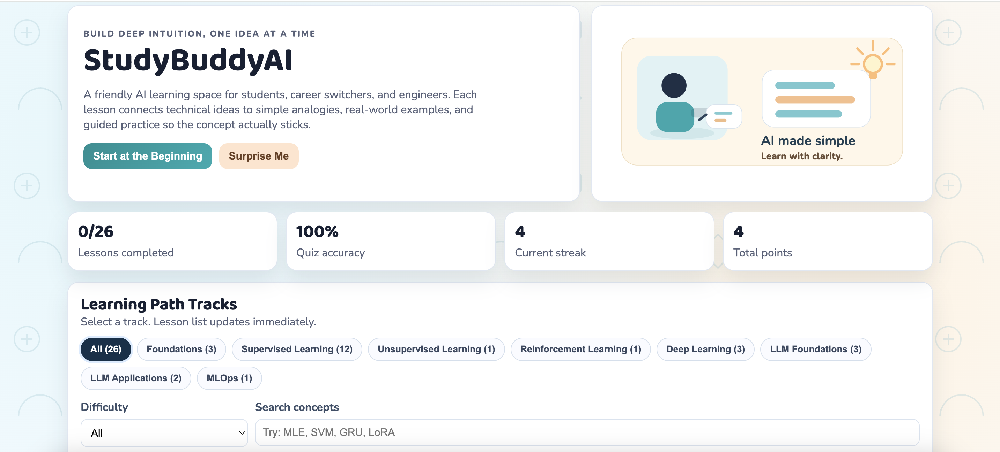
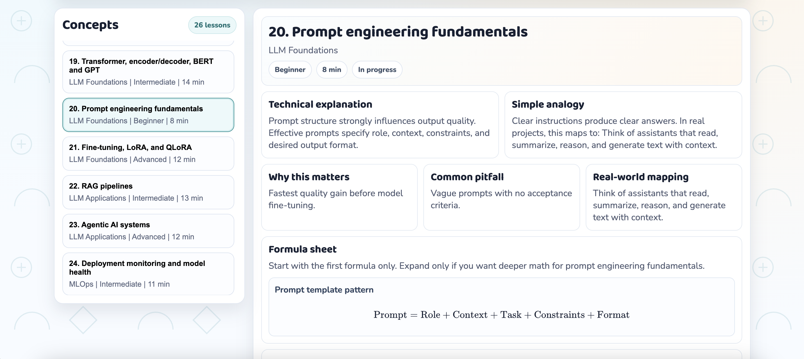
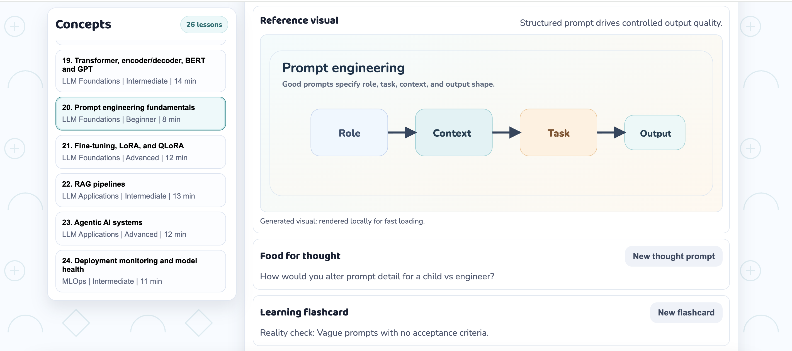
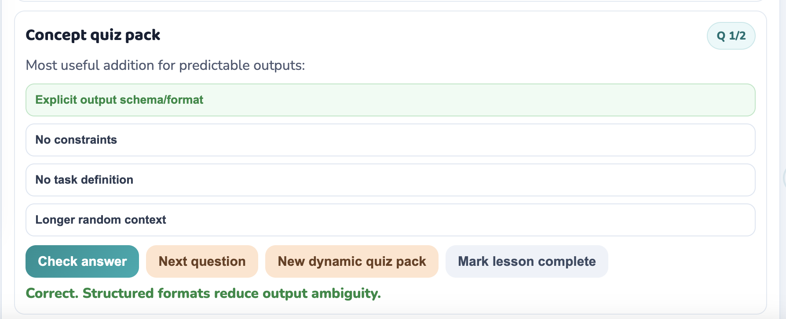
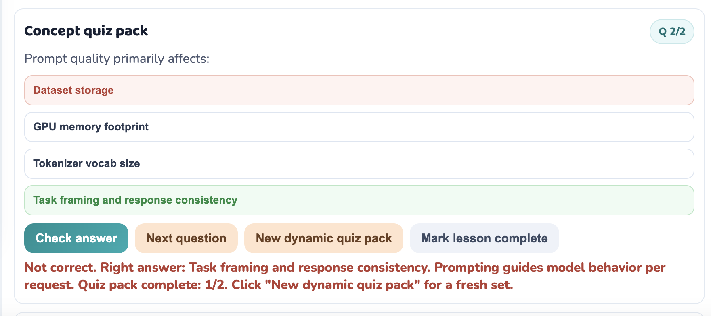
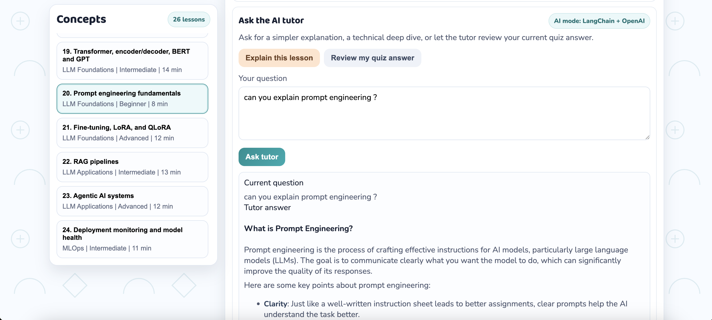
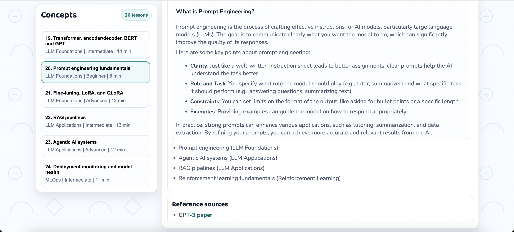

# StudyBuddyAI

StudyBuddyAI is a fundamentals-first AI education platform designed to make machine learning and modern AI easier to understand without diluting the technical meaning.

The goal is simple: help learners move from memorizing jargon to actually building intuition!
This is still a work in progress and my passion to create solutions that can actually help others will help me drive this thing :)

## Screenshots

### Home Page

### Learning Snapshots

<table>
  <tr>
    <td></td>
    <td></td>
  </tr>
</table>

### Concept Quiz

<table>
  <tr>
    <td></td>
    <td></td>
  </tr>
</table>

### AI Tutor In Action

<table>
  <tr>
    <td></td>
    <td></td>
  </tr>
</table>

## Why This Project Exists

A lot of AI learning today starts too far up the stack. People hear terms like transformers, RAG, agents, fine-tuning, and embeddings before they have a strong grasp of regression, classification, model evaluation, generalization, or probability.

StudyBuddyAI is built to close that gap.

It teaches concepts from the ground up using:
- technical explanations
- simple analogies
- real-world mappings
- formulas
- short concept checks
- an AI tutor for follow-up questions

## What Learners Can Explore

The platform covers a broad learning path across machine learning and AI, including:

- AI landscape and learning paradigms
- MLE, MAP, and probabilistic estimation
- train, validation, and test splits
- linear, polynomial, ridge, lasso, and logistic regression
- bias-variance tradeoff
- regression and classification loss functions
- Bayes theorem and Naive Bayes
- support vector machines
- parametric vs non-parametric models and kNN
- decision trees, random forest, bagging, boosting, and XGBoost
- clustering and PCA
- reinforcement learning basics
- feedforward neural networks and backpropagation
- CNNs, RNNs, LSTMs, and GRUs
- transformers, BERT, and GPT-style models
- prompt engineering
- fine-tuning, LoRA, and QLoRA
- RAG pipelines
- agentic AI systems
- deployment monitoring and model health

## What Makes StudyBuddyAI Different

StudyBuddyAI is not just a concept dictionary.

Its core value is translation across levels of understanding. Each lesson is designed to help a learner move between:

- the formal technical idea
- a simple analogy
- a practical use case
- the math or formula behind it

That makes it useful for:

- students learning machine learning for the first time
- non-technical learners trying to understand AI clearly
- engineers who can build with tools but want stronger foundations
- interview preparation where conceptual clarity matters

## AI Tutor Experience

StudyBuddyAI includes an AI tutor that supports lesson-aware questioning.

Instead of only showing static content, the tutor can help learners:

- ask follow-up questions in natural language
- request simpler explanations
- connect intuition back to the formal concept
- review quiz answers and clarify mistakes

The tutor layer is built around a retrieval-based setup so responses stay grounded in the lesson material rather than drifting into generic explanations.

## LangChain + LLM Layer

The project includes a LangChain-powered tutor workflow connected to an LLM backend.

At a high level, this layer is used to:

- retrieve lesson-relevant context
- frame the learner’s question in the right educational context
- generate cleaner, more structured explanations
- support interactive tutoring beyond static lesson cards

This makes the platform more than a content website. It becomes a guided learning system with an interactive educational assistant.

## Evaluation and Reliability Workflow

StudyBuddyAI includes a LangSmith-oriented workflow to make the tutor measurable and reliable, not just interactive.

It covers:

- traceable tutor and answer-review runs
- failure inspection with backend failure logs
- prompt/chain variant comparison (`baseline` vs `improved`)
- repeatable local eval cases for regression testing
- concrete changes tied to measured outcomes

### Failure Mode -> Change -> Result

- Failure mode: the first improved prompt was more concise, but it dropped technical coverage.
- Change made: increased retrieval depth and enforced an explicit "Core terms" list in the improved variant.
- Result: improved variant outperformed baseline across quality metrics on the same eval set.

Latest local evaluation snapshot (6 cases):

| Variant | Avg Final Score | Avg Keyword Recall | Avg Concise Score | Failure Rate |
|---|---:|---:|---:|---:|
| `baseline` | 0.8654 | 0.8333 | 0.9615 | 0.0000 |
| `improved` | **0.9500** | **0.9333** | **1.0000** | 0.0000 |

This workflow helps build educational agents that are easier to trust in production because behavior is traceable, comparable, and iteratively improvable.

Local test guide:
- `LANGSMITH_LOCAL_TEST.md`

## Learning Experience

Each lesson is structured to make the concept stick.

Learners move through:

- a technical explanation
- a simpler analogy
- a real-world mapping
- a formula sheet
- a visual reference
- a short thought prompt
- a flashcard-style takeaway
- a concept quiz pack

The app also includes a **Hard reset progress** button to clear local browser-stored progress instantly during testing and demos.

The design choice is intentional: the platform tries to teach the same idea in multiple representations so the learner can build intuition, not just recognition.

## Why It Is Useful

StudyBuddyAI is useful because it addresses a real problem in AI education:

people often know the names of concepts before they understand the meaning of the concepts.

This project is built to slow that down in a productive way. It helps learners understand what a model is doing, why a method exists, when it works well, where it breaks, and how older machine learning foundations connect to modern LLM systems.

## Project Structure

This repository contains:

- `index.html` for the main interface
- `styles.css` for the visual design and layout
- `script.js` for lesson rendering, quizzes, interactions, and frontend tutor behavior
- `server.py` for serving the app and tutor API routes
- `backend/tutor_backend.py` for the tutor engine and LangChain-powered response flow
- `backend/tutor_knowledge.py` for the lesson knowledge base used for retrieval
- `requirements.txt` for Python dependencies

## Tech Stack

- HTML
- CSS
- JavaScript
- Python
- LangChain
- OpenAI API
- MathJax

GitHub’s language breakdown is generated automatically from the actual files in the repository, so once you push this repo it will naturally reflect the project mix such as JavaScript, HTML, CSS, and Python.

## Author

Created fully by **Shwetha Tinnium Raju**.
